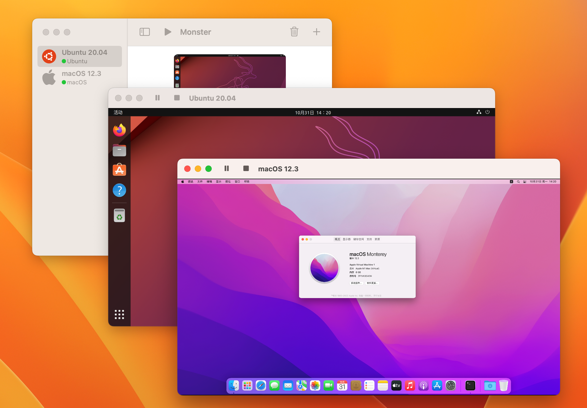

# Monster

Monster is a virtualization app that is based on Apple `virtualization.framework`.
It can run Linux or macOS virtual machines on macOS systems.

Monster 是一个虚拟机App，它基于Apple的*virtualization.framework*，可以在macOS系统上运行Linux或者macOS虚拟机。

### System requirements

macOS 13.0 or higher

### VM OS Support

| CPU           | OS                       |
| :------------ | ------------------------ |
| Intel         | Linux (x86)              |
| Apple silicon | Linux (arm64), macOS 12+ |

## Snapshots

## Development Environment

- macOS 13.0
- Xcode 14.1
